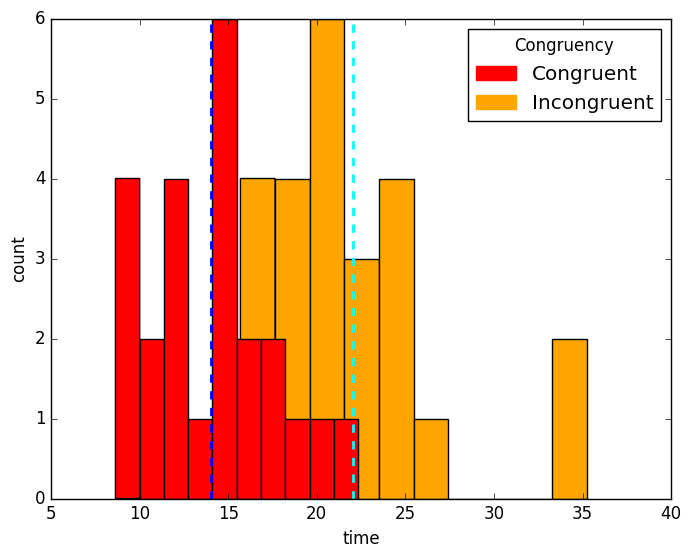
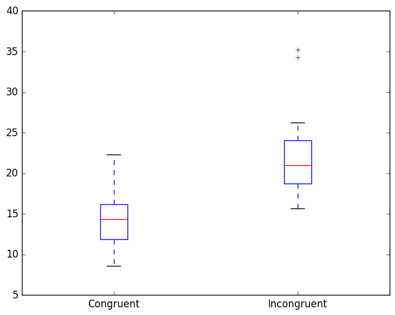

# Test A Perceptual Phenomenon
This repository contains all the scripts along with the test report generated to study the (Stroop Effect)[https://en.wikipedia.org/wiki/Stroop_effect]. 

# Usage
Run [stroop_effect_test.py](https://github.com/piyush2896/Test-A-Perceptual-Phenomenon/blob/master/stroop_effect_test.py) to see the result.

# Dependencies
1. Numpy
2. Scipy
3. Pandas
4. Matplotlib

# Conclusion
There is a significant difference in the congruent words test and incongruent words test.

